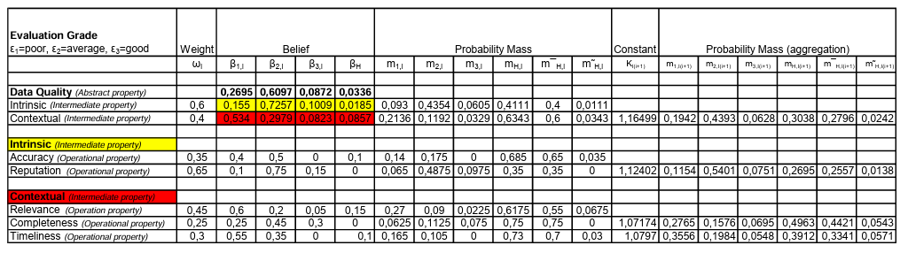

# THE-ICS-DEMPSTER-SHAFER-HOW-TO
Basically this is a paper(THE ICS DEMPSTER-SHAFER HOW TO  by  Pia Gustafsson, Robert Lagerström, Per Närman, Mårten Simonsson ) which is  implemented by me for our Artificial Inteligence lab project.

## 6 step calculation and equations

In this paper for data assesment ,mathmatical framework used 6 step , in below i just give the equations which were used to implemnt .

**Step 1 : Definition and representation of a multiple attribute decision problem**

**Step 2 : Basic probability assignments for each basic attribute**

**Step 3 : Combined probability assignments for a general attribute**

**Step 4 : Calculation of the combined degrees of belief for a general property**

**Step 5 : Representation of the distributed overall assessment and calculation of the expected utility**

**Step 6 :  Calculation of the utility interval of incomplete assessments**

**project output**

**paper's data table**

